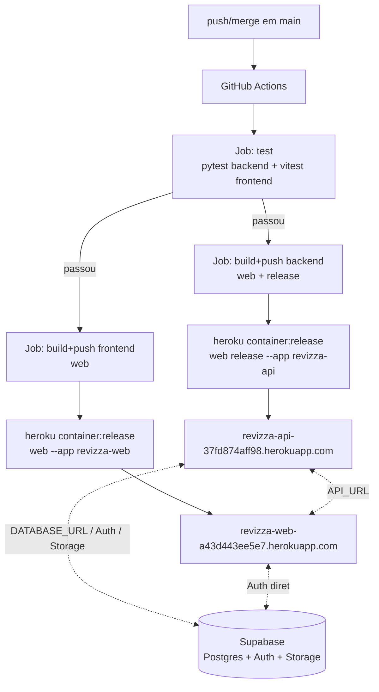

# Deploy — Docker + GitHub Actions + Heroku + Supabase

Fluxo de CI/CD para produção/teste fechado. Workflow em `.github/workflows/deploy.yml` e os targets
`web`/`release` em `backend/Dockerfile` já implementados e testados localmente (`docker build
--target web|release`). **Falta só infraestrutura manual**: os apps Heroku em si não existem ainda
(ver "Pré-requisitos únicos" abaixo) — o pipeline vai falhar no primeiro push até esses passos serem
feitos uma vez.

Complementa `docs/docker.md` (build local das mesmas imagens). Aqui o foco é: quem builda, pra onde
empurra, e como o Supabase entra nisso.

## Escopo

- **Cobre**: pipeline GitHub Actions que testa, builda as imagens Docker (`backend/Dockerfile`,
  `frontend/Dockerfile`) e faz deploy em dois apps Heroku via Container Registry.
- **Não cobre**: criação inicial dos apps Heroku (manual, uma vez), configuração do Supabase Auth
  (redirect URLs, manual, uma vez), domínio/DNS próprios, staging (fora do MVP — YAGNI, Constituição
  Princípio V). Ver "Fora de escopo" no fim.
- **Add-on**: não entra nesse pipeline — é `.ankiaddon` distribuído fora (build já coberto por
  `addon/build.py`, T128).

## Visão geral

Dois apps Heroku (backend e frontend nunca compartilham dyno — Heroku roteia um único processo `web`
por app). Supabase é sempre externo, nunca entra no pipeline de deploy — só recebe migrations do
Django via release phase do backend.

## Pré-requisitos únicos (manuais, antes do primeiro deploy automatizado)

1. `heroku create revizza-api` e `heroku create revizza-web` — **feito**: hostnames públicos reais
   `revizza-api-37fd874aff98.herokuapp.com` e `revizza-web-a43d443ee5e7.herokuapp.com` (o Heroku
   gera um sufixo hash, não é mais `<nome>.herokuapp.com` puro — atualizar se recriar os apps).
2. `heroku stack:set container -a revizza-api` e o mesmo para `revizza-web` — **feito**.
3. Configurar as env vars de runtime do backend (`heroku config:set -a revizza-api ...`) — **feito**:
   `DJANGO_SECRET_KEY`, `DJANGO_ALLOWED_HOSTS`, `DJANGO_CORS_ALLOWED_ORIGINS`,
   `PASSWORD_RESET_REDIRECT_URL`, `DATABASE_URL`, `SUPABASE_URL`, `SUPABASE_JWT_SECRET`,
   `SUPABASE_SERVICE_ROLE_KEY`. Frontend não precisa de config var — só `PORT`, injetada
   automaticamente pelo Heroku. Ver tabela de segredos abaixo.
4. Gerar um `HEROKU_API_KEY` (`heroku authorizations:create`) e salvar como secret no GitHub
   (Settings → Secrets and variables → Actions) — **feito**.
5. Salvar `NEXT_PUBLIC_SUPABASE_URL`/`NEXT_PUBLIC_SUPABASE_ANON_KEY` como secrets no GitHub também
   (build args do frontend) — **feito**.
6. Registrar a URL de produção do frontend em Supabase → Auth → URL Configuration (redirect do
   password reset — já um `PASSWORD_RESET_REDIRECT_URL` no backend, precisa bater com o valor lá) —
   **pendente**: só dashboard, sem API/MCP pra isso.
7. Confirmar o bucket `media` no Supabase Storage existe (T137) — **feito**: `media` existe,
   `public: false` (correto — acesso só via signed URL).

Nenhum desses passos é automatizável de forma segura via GitHub Actions (criação de infra e
segredos de terceiro) — ficam como runbook manual, não como código.

## Achado ao planejar: Container Registry ignora o Procfile

O `backend/Procfile` (`web:` + `release:`) **não é lido** em deploys via Container Registry —
diferente do fluxo de buildpack (que a Constituição documentava originalmente). Heroku decide o tipo
de processo pela tag da imagem (`registry.heroku.com/<app>/<tipo>`), não pelo Procfile. Confirmado na
doc oficial do Heroku (Container Registry and Runtime) e implementado em `backend/Dockerfile`: três
estágios nomeados (`base` → `release`, `web`), `web` por último de propósito para continuar sendo o
target padrão de `docker build .` sem `--target` (preserva `docker-compose.yml` sem mudança).

`curl` é instalado só no estágio `release`, exigência do Heroku pra transmitir logs em tempo real do
release phase — **verificado**: `python:3.12-slim` não inclui `curl` por padrão (`docker run --rm
python:3.12-slim which curl` retorna vazio), então precisou de
`apt-get install -y --no-install-recommends curl` antes do `CMD` de `release`. Sem `curl` o release
ainda funcionaria — só os logs em tempo real do `container:release` ficariam indisponíveis.

O frontend não precisa de estágio `release` — não há migration nem estado a aplicar; `frontend/Dockerfile`
continua single-purpose (só `web`).

## Pipeline GitHub Actions

Implementado em `.github/workflows/deploy.yml` — gatilho `push` em `main` (sem staging, sem deploy
por PR — MVP/YAGNI). Quatro jobs, na ordem:

1. **test**: `pytest` (backend) + `npm run test` / vitest (frontend). Falha aqui aborta o deploy —
   código quebrado nunca chega a virar imagem.
2. **build-and-push-backend** (paralelo ao 3): builda os targets `web` e `release`, `docker push`
   das duas tags pro Container Registry.
3. **build-and-push-frontend** (paralelo ao 2): builda `web` com os `NEXT_PUBLIC_*` como build args
   vindos de GitHub Secrets, `docker push`.
4. **release**: `heroku container:release web release --app $HEROKU_BACKEND_APP` (roda a imagem
   `release` primeiro — migrations — só promove `web` depois que ela terminar sem erro), depois
   `heroku container:release web --app $HEROKU_FRONTEND_APP` (sem release phase, só promove).

Nomes dos apps (`revizza-api`/`revizza-web`) ficam em `env:` no topo do workflow — trocar ali se os
nomes reais divergirem ao criar os apps Heroku.

## Segredos: GitHub Actions vs Heroku config vars

Dois lugares diferentes, papéis diferentes — não confundir:

| Onde | Quando é lido | Exemplos | Por quê |
|---|---|---|---|
| **GitHub Actions secrets** | Build time (dentro do workflow) | `HEROKU_API_KEY`, `NEXT_PUBLIC_SUPABASE_URL`, `NEXT_PUBLIC_SUPABASE_ANON_KEY`, `NEXT_PUBLIC_API_URL` | `NEXT_PUBLIC_*` viram parte do bundle JS no `docker build` (mesma lição de `docs/docker.md`) — precisam existir antes do build, não no runtime do dyno |
| **Heroku config vars** (`heroku config:set`) | Runtime (cada boot do dyno) | `DJANGO_SECRET_KEY`, `DATABASE_URL`, `SUPABASE_SERVICE_ROLE_KEY`, `SUPABASE_JWT_SECRET`, `DJANGO_ALLOWED_HOSTS`, `DJANGO_CORS_ALLOWED_ORIGINS`, `SENTRY_DSN`, `EMAIL_*` | Segredos de servidor — nunca devem entrar em uma imagem Docker (ficaria em cache/camada, exposto a quem tiver a imagem) |

`DJANGO_CORS_ALLOWED_ORIGINS` no backend precisa incluir a URL do app frontend
(`https://revizza-web-a43d443ee5e7.herokuapp.com`); `NEXT_PUBLIC_API_URL` no frontend precisa apontar pro backend
— os dois apps se referenciam por URL pública, não por rede interna (Heroku não oferece rede privada
entre apps distintos no plano Common Runtime).

## Rollback

Container Registry mantém histórico de releases por app: `heroku releases -a revizza-api` lista, e
`heroku releases:rollback v<N> -a revizza-api` volta pra uma imagem anterior sem rebuild — mesmo
mecanismo pros dois apps. Alternativa: reexecutar o workflow do commit anterior no GitHub Actions.

## Papel do Supabase neste pipeline

Supabase nunca é alvo de deploy — é sempre a dependência externa já provisionada (Constituição,
Technology Constraints). Este pipeline só toca Supabase de duas formas:

- **Migrations Django** rodam dentro do `release` phase do backend (`manage.py migrate`), contra o
  `DATABASE_URL` configurado como Heroku config var — não existe passo separado de "deploy do banco".
- **Nada mais é automatizado**: mudança de schema fora do ORM Django (extensões Postgres, políticas
  RLS além do que `check_data_api_isolation` audita), configuração de Auth (redirect URLs) e o bucket
  de Storage continuam manuais via dashboard/CLI Supabase — não fazem parte deste workflow.

## Fora de escopo (por enquanto)

- **Staging/preview environments**: um único ambiente de produção/teste fechado é suficiente pro
  momento atual (conversa anterior: "não será disponibilizada para novos usuários, apenas testes").
  Revisitar se o projeto sair do teste fechado.
- **Domínio próprio**: os apps ficam em `*.herokuapp.com` até haver decisão de domínio.
- **Deploy automatizado de infraestrutura Heroku/Supabase** (Terraform ou similar): os pré-requisitos
  acima continuam manuais — criar infra via IaC é desproporcional ao tamanho atual do projeto
  (Constituição, Princípio V).

## Referências

- `.github/workflows/deploy.yml` — workflow completo (fonte da verdade dos comandos exatos).
- `backend/Dockerfile` — targets `base`/`release`/`web`.
- [Heroku Container Registry and Runtime](https://devcenter.heroku.com/articles/container-registry-and-runtime) — mecânica de `container:push`/`container:release`, Dockerfile por processo, release phase.
- `docs/docker.md` — build e execução local das mesmas imagens.
- `backend/Procfile` — comandos de referência (não lidos pelo Container Registry, mas úteis como
  documentação do que cada processo faz e para rodar localmente com `heroku local` se necessário).
