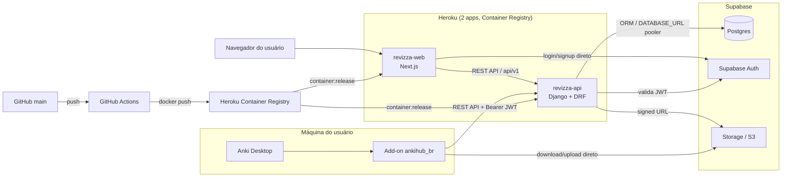
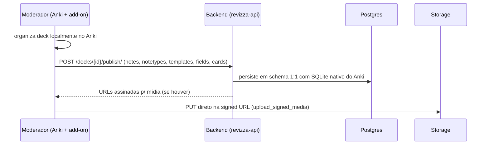
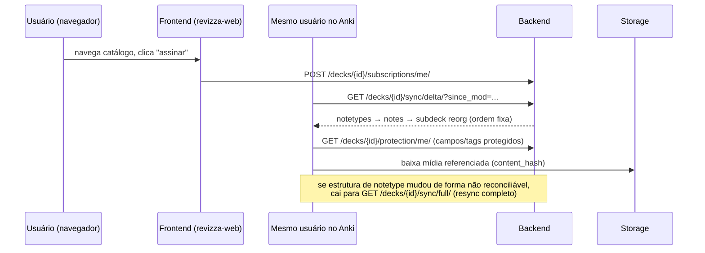
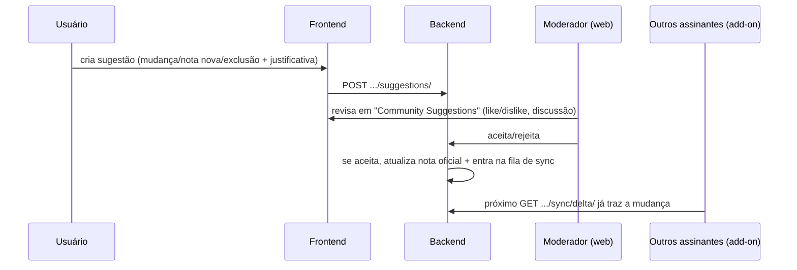

# Fluxo do sistema — addon, backend, frontend, GitHub, Heroku

Visão de ponta a ponta: como as três aplicações (add-on Anki, backend Django, frontend Next.js) se
comunicam entre si e com a infraestrutura (Supabase, GitHub, Heroku). Detalhes de deploy já ficam em
`docs/deploy.md` e `docs/docker.md` — este doc referencia, não repete.

## Componentes

Regra chave: **add-on nunca fala com Supabase Auth diretamente** — ele guarda o JWT que o usuário
obteve (login web ou fluxo próprio do add-on) e manda como `Authorization: Bearer` em toda chamada
ao backend (`addon/ankihub_br/ankihub_br_client/client.py`). O backend é quem valida o token contra
o Supabase Auth (`config/authentication.py`) — nem addon nem frontend confiam em si mesmos, sempre o
backend arbitra.

## Fluxo 1 — Publicar deck (moderador)

Import é **create-only**: só funciona em deck inexistente no backend (Constituição, Princípio I).
Depois desse ponto o fluxo vira unidirecional — o add-on nunca republica.

## Fluxo 2 — Assinar e sincronizar (estudante)

Sync é sempre **web → add-on**, nunca o contrário. Campos/tags marcados
`AnkiHubBR_Protect::<Campo>` no lado do usuário não são sobrescritos pelo delta.

## Fluxo 3 — Sugerir → moderar → propagar

## Fluxo 4 — GitHub → Heroku (CI/CD)

Resumo (detalhe completo em `docs/deploy.md`):

1. `push`/merge em `main` dispara `.github/workflows/deploy.yml`.
2. Job `test`: pytest (backend) + vitest (frontend) — falha aqui aborta o deploy.
3. Jobs paralelos `build-and-push-backend`/`build-and-push-frontend`: `docker build` +
   `docker push` pro Heroku Container Registry (`backend/Dockerfile` gera `web`+`release`;
   `frontend/Dockerfile` só `web`).
4. Job `release`: `heroku container:release` promove as imagens — backend roda `release`
   (migrations Django) antes de promover `web`.

Sem staging, sem deploy por PR (MVP fechado — Constituição, Princípio V). Add-on **não** entra
nesse pipeline: é `.ankiaddon` empacotado por `addon/build.py` e distribuído fora do CI.

## Papel do Supabase

Externo aos dois apps Heroku, nunca alvo de deploy:

- **Postgres**: única fonte de dados, acessado pelo backend via `DATABASE_URL` (Supavisor
  pooler — conexão direta não funciona no Heroku, ver `docs/deploy.md`).
- **Auth**: emite os JWT que frontend e add-on carregam; backend valida.
- **Storage**: mídia dos decks, sempre via signed URL — add-on e frontend fazem upload/download
  direto no Storage, nunca passam o binário pelo backend.

## Referências

- `docs/deploy.md` — pipeline CI/CD completo, segredos, rollback.
- `docs/docker.md` — build local das imagens.
- `addon/ankihub_br/ankihub_br_client/client.py` — único ponto do add-on que fala HTTP com o backend.
- `backend/config/authentication.py` — validação do JWT do Supabase.
- `.specify/memory/constitution.md` — princípios (import create-only, sync unidirecional, LGPD).
- `PRD-AnkiHub-Brasil.md` §4.1–4.3 — arquitetura e user stories completas.
